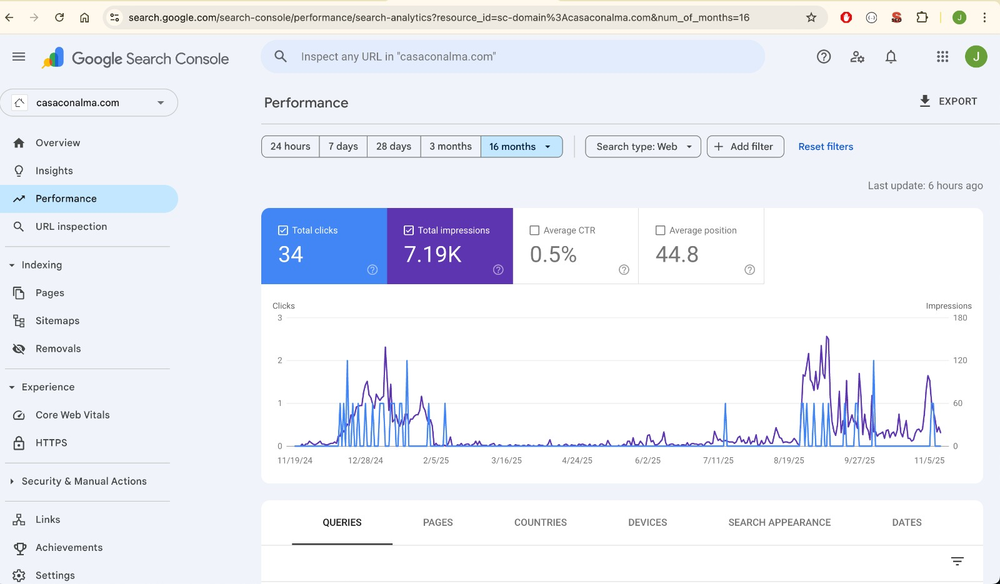
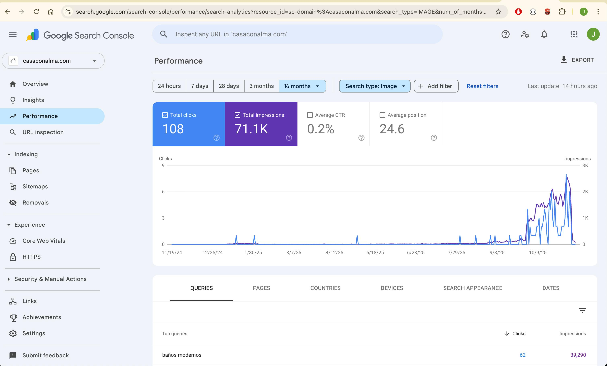
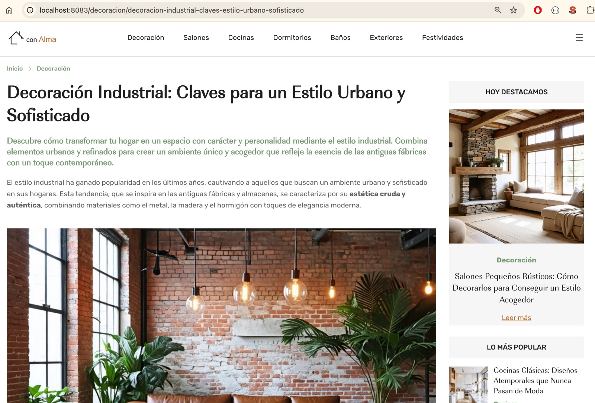
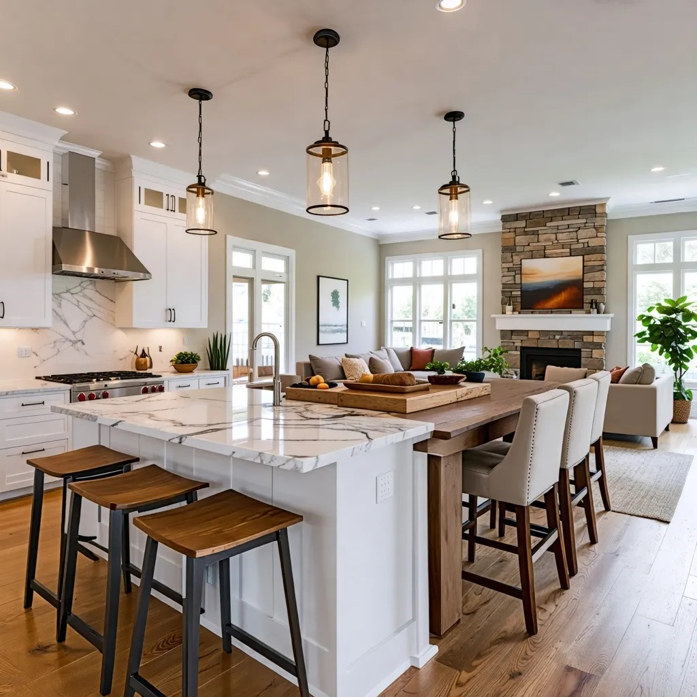
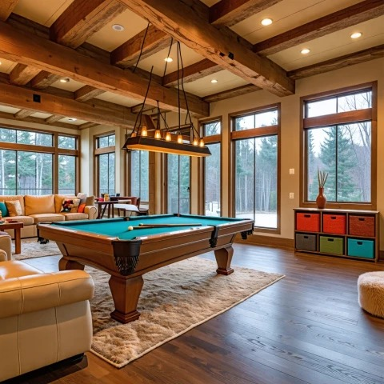

# 🏡 CasaConAlma — Fully Automated AI-Generated Home Decor Platform
### *End-to-end LLM Pipeline · Multimodal Embeddings · Image Generation · SEO Automation · Kotlin · Spring Boot · AWS*

**CasaConAlma** is a fully automated AI-driven content generation platform that transforms a **single article title** into a complete, SEO-optimized, image-rich webpage.  
Built end-to-end as a **full-cycle generative AI product**, it validates a real multimodal pipeline from **prompt → article → images → embeddings → static HTML → deployment → indexing**.

> ⚠️ **Note:** This project does *not* reflect my usual production-level standards (no tests, simplified architecture).  
> It is intentionally a fast, practical proof of concept — but fully functional, deployed, indexed by Google, and grounded in modern AI techniques.

---

# 🚀 Core Capabilities (High-Level)

### ✔ Single-title input → Full article generation
### ✔ Claude (Haiku/Sonnet via Amazon Bedrock) for structured editorial text
### ✔ AI-generated prompts → Photorealistic images (Stable Image Core/Ultra)
### ✔ Multimodal embeddings (Cohere) for semantic alignment
### ✔ Automatic captions, ALT tags, SEO metadata
### ✔ Dedicated image sitemap for Google Images
### ✔ Static site generation + AWS hosting (S3 + CloudFront) (Serverless)
### ✔ Embedding-based internal linking

The system operates **completely hands-off** once launched.

---

# 🎨 Image Generation Pipeline (Stable Image Core & Ultra)

For each section of the article, the LLM produces **semantic, controllable prompts** describing:

- interior style
- lighting & camera lens
- materials
- furniture
- colors & textures
- scene composition

Images are generated via:

- **Stable Image Core** → fast iterations
- **Stable Image Ultra** → editorial-quality results

Images are then evaluated, captioned, embedded, and inserted in the article at the appropriate semantic position.

---

# 🧩 Multimodal Pipeline: Image Embeddings, Captions & Semantic Indexing

To ensure text–image coherence, CasaConAlma performs a **multimodal understanding step**:

### ✔ **Image embeddings (Cohere Multimodal)**
Extracted to evaluate:

- text ↔ image similarity
- scene coherence
- style consistency
- semantic relevance
- outlier detection

### ✔ **LLM-generated descriptions & captions**
For each image:

- natural-language description
- SEO-optimized caption
- ALT text
- short embedding-friendly summary

Used for accessibility, SEO, and multimodal reasoning.

### ✔ **Image sitemaps**
All images are indexed via a dedicated **Google-compliant image sitemap**.

## 🚀 System Overview (8-Step Pipeline)

### **1 → Input**
Single article title.

---

### **2 → LLM Orchestration (Bedrock: Claude Haiku/Sonnet)**
Multi-step expert prompts generate a structured JSON spec containing:
- Article body (H1/H2/H3)
- SEO metadata (title, slug, canonical, keywords, description)
- Section summaries
- Image prompts (per section)
- ALT text & captions
- Semantic summaries
- Related-article hints for internal linking

---

### **3 → Image Prompt Refinement**
LLM outputs compositional prompts including:
- style
- lens
- lighting
- materials
- colors
- spatial geometry

---

### **4 → Image Generation (Stable Image Core & Ultra)**
- **Core:** fast iterations
- **Ultra:** high-fidelity editorial images  
  All images are linked to their originating article section.

---

### **5 → Multimodal Embeddings (Cohere)**
Text + image embeddings used for:
- text–image similarity
- relevance scoring
- semantic quality checks
- clustering & deduplication
- embedding-based internal linking

---

### **6 → Structured HTML Generation**
Thymeleaf templates generate:
- fully styled article pages
- inlined images
- captions + ALT text
- schema metadata

---

### **7 → Publication Pipeline**
- Static output → **S3 bucket** (via Pulumi)
- Delivered through **CloudFront + Route53**

---

### **8 → SEO Layer**
- page sitemap
- **image sitemap** (Google-compliant)
- semantic linking based on embeddings

---

# ⚙️ Architecture Overview

```
[ Article Title ]
        ↓
[ Claude LLM Orchestrator (Bedrock) ]
        ↓
[ JSON Article Spec ]
        ↓
 ┌───────────────────────┬──────────────────────────┐
 │                       │                          │
 │      Text Output      │      Image Prompts        │
 │  (article, SEO, etc.) │  (per-section prompts)    │
 │                       │                          │
 └───────────────────────┴──────────────────────────┘
        ↓                          ↓
[ Text Embeddings (Cohere) ]   [ Stable Image Core/Ultra ]
        ↓                          ↓
        └──────────→ [ Image Embeddings (Cohere) ] ←──────────┘
                          ↓
                 [ Semantic Scoring Layer ]
                          ↓
                [ HTML Generator (Thymeleaf) ]
                          ↓
              [ S3 + CloudFront + Sitemaps ]

```

---

# 📈 Real SEO Performance

- **7,190 impressions**
- **34 clicks**
- **44.8 avg. position**
- Hundreds of indexed pages
- Zero manual content creation

### 📊 Web Performance in Google Search Console:


### 📊Image Performance in Google Search Console:


---

# Showcase Site

## 📸 Showcase — Website Snapshots

### 🏠 Home Page


---

### 📝 Article Page



---

### 📂 Category Page


---

### 🔗 Related Content


---

### 🖼️ Generated Images Gallery Example







---

# 🛠 Tech Stack

Backend: Kotlin, Spring Boot, PostgreSQL, Jackson, Thymeleaf  
AI: Bedrock (Claude), Stable Image Core/Ultra, Cohere embeddings  
Infra: AWS S3, CloudFront, Route53, Pulumi IaC

---

# 🧪 Limitations (Intentional for a POC)

- No automated tests
- Simplified architecture
- No queueing or retry strategies
- Modules grew organically
- No content curation processes
- No content generation jobs
---

# 🧭 Roadmap

- Strict hexagonal rewrite
- Full test coverage
- Multimodal quality scoring
- RAG-based consistency
- LoRA/ControlNet image models
- A/B SEO testing
- Regeneration pipeline
- Content Curation & remove duplication algorithms
- Add agentic approach
- Image LLM training + ComfyUI + Image quality filters... (Cheap image generation to escale up)
---

# 📬 Contact
**Jordi Cortés Bravo** — Senior Software Engineer & Technical Lead  
Spain (Remote)

---

### 🧠 What This Project Demonstrates About My Skillset
- Ability to design and implement full AI-driven systems (LLMs + multimodal)
- Strong architectural thinking and real pipeline design
- Prompt engineering at scale (multi-step, JSON schemas)
- Embeddings-based search, linking & semantic reasoning
- Production-grade infra: AWS + Pulumi + S3 + CloudFront
- Ability to ship independently: backend + AI + SEO + infra


# ✔ Summary

CasaConAlma demonstrates my ability to design and implement **complete AI-driven systems**, combining LLM orchestration, multimodal reasoning, embeddings, static site automation, AWS deployment, and product-level execution.
